# Masamuneフレームワーク開発ガイド for Claude Code

このドキュメントは、Claude Code (claude.ai/code)がこのリポジトリで効率的に開発を行うための包括的なガイドラインです。

## 🎯 最重要原則

### 1. 必ず守るべき5つの鉄則
1. **手動でのファイル作成禁止** → 必ず`katana code`コマンドでテンプレート生成
2. **段階的な実装とバリデーション** → 1つの実装ごとに必ず`flutter analyze && dart run custom_lint`を実行
3. **エージェントの積極活用** → 各開発フェーズで適切な専門エージェントを使用
4. **UI確認の最適化** → 開発中は`katana code debug`で素早く確認、コミット前に`katana test update`で最終確認
5. **エラーの即時対処** → エラーは後回しにせず、発見次第修正

### 2. 開発フローの絶対的な順序
```
実装 → バリデーション → 修正 → UI確認(katana code debug) → 次の実装
→ ... 実装完了 → 最終テスト(katana test update)
```
この順序を絶対に崩してはいけません。

## 🤖 専門エージェントシステム

開発の各フェーズで専門的なサポートを提供する実装エージェントが利用可能です。これらのエージェントは単なるガイドではなく、実際にコードを生成し、実装を行います。

### 基本エージェント（Core Agents）

#### 1. masamune_framework_advisor
**役割**: Masamuneフレームワーク専門アドバイザーとして、具体的な実装コードを提供

**使用場面**:
- フレームワーク機能の実装方法（Model、Page、Controller、Widget、Form等）
- 実装パターンやベストプラクティスの適用
- ModelFieldValueタイプの使用方法
- フレームワーク固有の概念の実装

**使用例**:
```
「ModelTimestampの使い方を教えてください」
→ 具体的な実装コードと使用例を提供
```

#### 2. package_advisor
**役割**: 最適なパッケージ選定と具体的な実装コードを提供

**使用場面**:
- 機能実装に必要なパッケージの選定
- Masamuneプラグインの優先的な提案
- パッケージの評価（更新頻度、品質指標）
- 実装コストと効果の分析

**評価基準**:
- 最終更新: 6ヶ月以内（1年以上は原則不採用）
- pub.dev: likes数50以上、pub points90以上推奨
- 導入コスト: 3ステップ以内が理想

**使用例**:
```
「位置情報取得機能を実装したい」
→ 適切なパッケージと実装コードを提供
```

#### 3. ui_builder
**役割**: 画像やFigmaデザインからFlutter UIコードを生成

**使用場面**:
- スクリーンショットからのUI実装
- Figmaデザインの変換
- 手書きスケッチの実装
- 既存UIの修正

**使用例**:
```
「この画像からFlutter UIを作成して」
→ MasamuneフレームワークでのUIコードを生成
```

#### 4. ui_debugger
**役割**: UI実装の検証と問題分析を実行

**使用場面**:
- UIの実装検証
- 目標デザインとの差分分析
- flutter_widget_inspector連携
- デバッグ画像生成（katana code debug）

**使用例**:
```
「現在のUIが目標デザインと一致しているか確認」
→ 差分分析と修正提案を提供
```

#### 5. firebase_flutter_debugger
**役割**: FirebaseバックエンドとFlutterフロントエンドの問題を診断・解決

**使用場面**:
- Dartランタイムエラーの調査
- Firebase Functionsログの分析
- Firestoreデータ整合性の確認
- フロントエンド/バックエンド間の問題特定
- 認証・データアクセス関連のトラブルシューティング

**使用例**:
```
「ユーザー登録でエラーが発生しています」
→ Dartエラー、Functionsログ、Firestoreデータを横断調査し根本原因を特定

「Firestoreにデータが正しく保存されていません」
→ フロントエンドのデータ送信とバックエンドの保存処理を検証
```

#### 6. test_runner
**役割**: テストを実際に実行し、結果を分析

**使用場面**:
- ゴールデンテスト更新と実行
- 全体テストの実行
- テストエラーの診断
- 最大3回のリトライループ実行

**使用例**:
```
「UIを変更したのでテストを更新して」
→ katana test updateを実行し、結果を報告
```

### 開発フェーズ別エージェント（Development Phase Agents）

#### 7. initial_development_requirements_analyzer
**役割**: 新規プロジェクトの要件分析と実装計画立案

**使用場面**:
- プロジェクト開始時の要件分析
- 機能要件から実装タスクへの分解
- 技術選定と実装方針の決定
- 必要な設計書のリスト化

**出力**:
- 構造化された実装計画
- 技術スタック選定結果
- 開発フェーズ分け
- リスク分析

#### 8. enhancement_development_requirements_analyzer
**役割**: 既存システムへの機能追加・改修の影響分析

**使用場面**:
- 機能追加の影響範囲特定
- リファクタリング計画
- データ移行の必要性確認
- 既存コードとの整合性確認

**出力**:
- 影響分析レポート
- 段階的実装計画
- リスク評価
- テスト戦略

#### 9. initial_development_designer
**役割**: 設計書を実際に作成

**使用場面**:
- 新規プロジェクトの設計書作成
- Model/Page/Controller設計
- データフロー設計
- テーマ設計

**出力**:
- documents/designs/配下の各種設計書
- 実装可能な詳細設計
- アーキテクチャ定義

#### 10. initial_development_implimenter
**役割**: 設計書に基づいてコードを実装

**使用場面**:
- 新規プロジェクトの実装
- katana codeコマンドでのテンプレート生成
- バリデーションとテスト実行
- 基盤機能の構築

**実行フロー**:
1. katana codeでテンプレート生成
2. 設計書に基づく実装
3. flutter analyze && dart run custom_lint
4. katana test実行
5. エラーがあれば修正（最大3回リトライ）

#### 11. enhancement_development_implimenter
**役割**: 既存システムへの機能追加・改修を実装

**使用場面**:
- 既存プロジェクトへの機能追加
- バグ修正とリファクタリング
- 後方互換性を保った改修
- 回帰テストの実行

**実行フロー**:
1. 影響範囲の確認
2. 段階的な実装
3. 既存テストの確認
4. 新機能テスト追加
5. 回帰テスト実行

## 📋 エージェント活用ワークフロー

### 新規プロジェクト開発フロー

```mermaid
graph LR
    A[要件定義] -->|initial_development_requirements_analyzer| B[要件分析]
    B -->|initial_development_designer| C[設計書作成]
    C -->|initial_development_implimenter| D[実装]
    D -->|test_runner| E[テスト]
    E -->|ui_debugger| F[UI検証]
```


### 機能追加・改修フロー

```mermaid
graph LR
    A[改修要件] -->|enhancement_development_requirements_analyzer| B[影響分析]
    B -->|enhancement_development_implimenter| C[実装]
    C -->|test_runner| D[テスト]
    D -->|ui_debugger| E[検証]
```


### 問題解決フロー

```mermaid
graph LR
    A[問題発生] -->|masamune_framework_advisor| B[解決策確認]
    B -->|package_advisor| C[パッケージ検討]
    C -->|実装| D[修正]
    D -->|test_runner| E[テスト]
```


## 🏗️ アーキテクチャ概要

### 設計パターン
1. **Page-Based Architecture**: `@PagePath`アノテーションによるページ構成
2. **Model-Driven Data**: Freezedモデル + ModelAdapterパターン
3. **Scoped State Management**: `ref.app`（アプリ全体） / `ref.page`（ページスコープ）
4. **Adapter Pattern**: バックエンド切り替え可能（Runtime → Firestore → Local）

### ファイル命名規則
```
Pages:       lib/pages/[name].dart      → [Name]Page クラス
Models:      lib/models/[name].dart     → [Name]Model クラス
Controllers: lib/controllers/[name].dart → [Name]Controller クラス
Widgets:     lib/widgets/[name].dart    → [Name] クラス
```

## 📁 プロジェクト構造

```
flutter_app_gitvibes/
├── .claude/
│   └── agents/              # エージェント定義
│       ├── masamune_framework_advisor.md
│       ├── package_advisor.md
│       ├── ui_builder.md
│       ├── ui_debugger.md
│       ├── test_runner.md
│       ├── initial_development_requirements_analyzer.md
│       ├── enhancement_development_requirements_analyzer.md
│       ├── initial_development_designer.md
│       ├── initial_development_implimenter.md
│       └── enhancement_development_implimenter.md
├── lib/                     # ソースコード
│   ├── pages/              # ページ
│   ├── models/             # データモデル
│   ├── controllers/        # コントローラー
│   └── widgets/            # ウィジェット
├── documents/
│   ├── designs/            # 設計書
│   ├── test/              # ゴールデンテスト画像
│   └── debugs/            # デバッグ画像
└── test/                   # テストコード
```

## 🛠️ 必須コマンドリファレンス

### コード生成
```bash
# テンプレート生成（必ず最初に実行）
katana code page [PageName]
katana code collection [Name]
katana code document [Name]
katana code controller [Name]
katana code widget [Name]
katana code value [Name]

# コード生成
katana code generate
```

### バリデーション（1実装ごとに必須）
```bash
flutter analyze && dart run custom_lint
```

### テスト
```bash
# UI確認用の画像生成（開発中の素早い確認用）
# 出力先: documents/debug/**/*.png
katana code debug [ClassName1],[ClassName2]

# ゴールデンテスト更新（コミット前の最終確認時のみ実行）
# ⚠️ Docker使用のため時間がかかる。完了直前に1度だけ実行すること
# 出力先: documents/test/**/*.png
katana test update [ClassName1],[ClassName2]

# 全テスト実行
katana test run
```

### 最終処理
```bash
# コードフォーマット
dart fix --apply lib && dart format . && flutter pub run import_sorter:main
```

## 💡 実装パターン

### データ読み込み
```dart
@override
Widget build(BuildContext context, PageRef ref) {
  final model = ref.app.model(TestModel.collection())..load();
  // モデルの読み込み/変更時にWidgetが再構築される
}
```

### コントローラー使用
```dart
final controller = ref.page.controller(TestController.query());
// ref.page: ページライフサイクルにスコープ
// ref.app: アプリライフサイクルにスコープ
```

### フォーム
```dart
final form = ref.page.form(LoginValue.form(LoginValue(email: "", password: "")));
// FormTextField, FormButton等と組み合わせて使用
```

## ⚠️ よくあるミスと対処法

### ❌ してはいけないこと
- 手動でのDartファイル作成
- バリデーションをスキップして次の実装に進む
- エージェントを使わずに独自判断で実装
- 開発中に`katana test update`を頻繁に実行（時間がかかる）
- エラーを無視して続行

### ✅ 必ずすること
- `katana code`でのテンプレート生成
- 1実装ごとのバリデーション実行
- 適切なエージェントの選択と使用
- 開発中は`katana code debug`でUI確認（素早い）
- コミット前に`katana test update`で最終確認（1度だけ）
- エラーの即時修正（最大3回リトライ）

## 🔍 トラブルシューティング

### エラーが出た場合の対処順序
1. エラーメッセージを確認
2. 該当エージェントに相談
3. エラー修正を実施
4. `flutter analyze && dart run custom_lint`で再確認
5. 3回失敗したら詳細エラーを出力して停止

### よくあるエラー
- **Missing generated file**: `katana code generate`を実行
- **Type mismatch**: 設計書と実装の型を確認
- **Import error**: `flutter pub add [package_name]`でパッケージ追加
- **Test failure**: `katana test update`でゴールデンテスト更新

## 📚 ドキュメント構造

### 設計書（`documents/rules/designs/`）
- 全体設計、メタデータ、モデル、ページ、コントローラー等の設計テンプレート

### 実装手順（`documents/rules/impls/`）
- 各コンポーネントの詳細な実装手順

### テスト手順（`documents/rules/tests/`）
- テスト実装フローとゴールデンテスト手順

### フレームワークドキュメント（`documents/rules/docs/`）
- Masamuneフレームワークの詳細な使用方法

## 🎓 学習リソース

### 優先順位
1. このドキュメント（CLAUDE.md）
2. 各エージェント定義（.claude/agents/*.md）
3. `documents/rules/docs/katana_cli.md` - CLIコマンド一覧
4. `documents/rules/impls/impl.md` - 実装フロー
5. 各種設計書・実装手順書

## 🚀 効率的な開発のための最重要Tips

1. **エージェントファースト**: 迷ったら適切なエージェントに相談
2. **バリデーションの徹底**: エラーゼロを維持
3. **UI確認の最適化**:
   - 開発中: `katana code debug`で素早く確認（数秒）
   - コミット前: `katana test update`で最終確認（時間がかかるため1度だけ）
4. **段階的実装**: 小さく実装、頻繁にテスト
5. **ドキュメント準拠**: 独自判断せず、ドキュメントとエージェントに従う

---

**重要**: このドキュメントは定期的に更新されます。開発開始前に最新版を確認し、必ず専門エージェントを活用してください。
